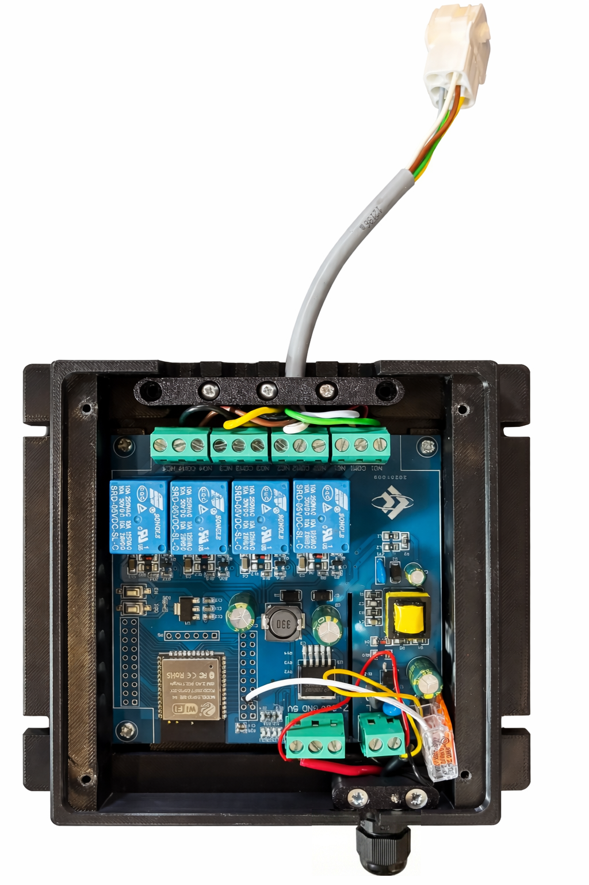

# ESP32 Wassertank-Sensor Emulator für Schaudt LT 316

Dieses Projekt emuliert eine Standard-5-Stab-Wassertanksonde für das [Schaudt LT 316](www.schaudt.gmbh) Anzeige-Panel. Es ermöglicht den Austausch der originalen mechanischen Stabsonde gegen einen modernen, hochpräzisen **berührungslosen Laser-Sensor (ToF)** wie den [BlueLevel+](www.bluelevel.de).

## Das Problem
Originale Wassertanks in Wohnmobilen (z.B. Weinsberg/Knaus) nutzen einfache Stabsonden. Das Schaudt LT 316 Panel erkennt den Füllstand, indem es prüft, welche Stäbe durch das Wasser gegen Masse kurzgeschlossen werden. Moderne Laser-Sensoren wie der BlueLevel+ liefern ein Spannungssignal (0–2,5V), das vom Schaudt-Panel nicht direkt verarbeitet werden kann.

## Die Lösung
Ein **ESP32** (auf einem [LC-Relay-ESP32-4R-A2 Board](https://amzn.eu/d/3VqQObJ)) liest das analoge 0–2,5V Signal des Laser-Sensors ein und wandelt es in vier Stufen um. Die integrierten Relais simulieren dem Schaudt-Panel das Eintauchen der Sondenstäbe. So bleibt die originale Anzeige erhalten, während die Messung berührungslos und absolut präzise erfolgt.

## Hardware-Anforderungen
*   **Mikrocontroller:** ESP32 (Bauform: [LC-Relay-ESP32-4R-A2](https://amzn.eu/d/3VqQObJ))
*   **Sensor:** [BlueLevel+](www.bluelevel.deprodukte/bluelevel-plus/) (Berührungsloser Laser-Sensor, 0V = Leer, 2,5V = Voll)
*   **Stromversorgung:** 12V DC aus dem Wohnmobil-Bordnetz.
*   **Programmierung:** [FTDI USB-zu-TTL Adapter](www.amazon.de) (auf 3,3V eingestellt).

## Verkabelung
1.  **Sensor:** Signalausgang des BlueLevel+ mit **GPIO 34** verbinden.
2.  **Relais (zum Schaudt Panel):**
    *   Alle **COM**-Anschlüsse der Relais mit der Masse (GND) des Schaudt-Eingangs verbinden.
    *   Die **NO**-Anschlüsse (Schließer) mit den Eingängen für 25%, 50%, 75% und 100% am Schaudt LT 316 verbinden.

## Flash-Anleitung
1.  Installieren Sie die [ESP32 Unterstützung in der Arduino IDE](docs.espressif.com).
2.  FTDI-Adapter verbinden (TX an RX, RX an TX, GND an GND).
3.  **IO0-Taste** gedrückt halten, **Reset-Taste** kurz drücken, dann **IO0** loslassen (Download-Modus).
4.  Code über die [Arduino IDE](www.arduino.cc) hochladen.
